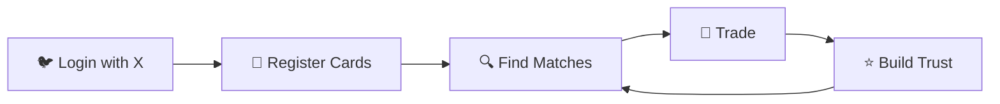
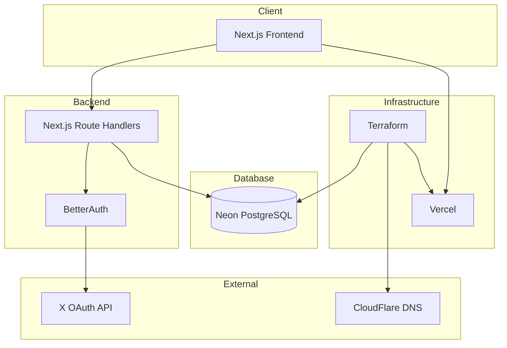

# xtrade

[](https://nextjs.org/)
[](https://codecov.io/gh/tqer39/xtrade)
[](https://github.com/tqer39/xtrade/actions/workflows/test.yml)
[](https://github.com/tqer39/xtrade/actions/workflows/terraform-dev.yml)
[](LICENSE)

[🇯🇵 日本語版](docs/README.ja.md)

> **Social trading platform powered by X (Twitter) — Trade cards with people you trust**

## 🎯 What is xtrade

xtrade is a **trust-based card trading platform** that leverages X (Twitter) social connections.

Traditional online card trading comes with risks — scams, no-shows, and disputes with strangers. xtrade solves this by **utilizing your X social graph** to help you trade only with people you know or trust.

- 🔐 **Trade with confidence** — Your X followers and connections become your trusted trading partners
- 📊 **Trust scores** — Built on real social relationships, not anonymous reputation
- 🎴 **Seamless matching** — Find trading partners who have what you want and want what you have

## ✨ Key Features

| Feature | Description |
| --- | --- |
| 🤝 **Trust-based Trading** | Leverage your X social graph for safe trades with trust scores |
| 🐦 **X Login** | One-click authentication via X OAuth |
| 🎴 **Card Management** | Manage your collection — cards you own and cards you want |
| 🔄 **Smart Matching** | Automatically find users who match your trade criteria |
| 📝 **Trade Tracking** | Full history of your trades and their status |
| 🏗️ **Infrastructure as Code** | Fully managed with Terraform |

## 📊 How It Works



### User Flow

1. **Login** — Authenticate with your X account
2. **Register Cards** — Add cards you own and cards you're looking for
3. **Find Matches** — Discover users who have what you want
4. **Trade** — Connect with trusted users and complete trades
5. **Build Trust** — Successful trades boost your trust score

## 🏛️ Architecture



## 🛠 Tech Stack

| Category | Technology |
| --- | --- |
| **Frontend** | Next.js 15 (App Router), React, TypeScript |
| **Backend** | Next.js Route Handlers |
| **Database** | Neon (Serverless PostgreSQL), Drizzle ORM |
| **Authentication** | BetterAuth + X OAuth |
| **Infrastructure** | Vercel, CloudFlare DNS, Terraform |
| **Development** | mise, just, prek |

## 🚀 Quick Start

```bash
# 1. Clone the repository
git clone https://github.com/tqer39/xtrade.git
cd xtrade

# 2. Install development tools (first time only)
make bootstrap

# 3. Setup everything
just setup

# 4. Start development server
npm run dev
```

Open [http://localhost:3000](http://localhost:3000) in your browser.

📖 **For detailed setup instructions**, see [Local Development Guide](docs/local-dev.md).

## 📁 Project Structure

```text
xtrade/
├── app/                    # Next.js App Router
│   ├── api/                # Route Handlers (API)
│   └── (pages)/            # Page components
├── src/
│   ├── lib/                # Utilities (auth, utils)
│   ├── db/                 # Database connection & schema
│   ├── modules/            # Domain modules
│   │   ├── trades/         # Trade domain
│   │   ├── cards/          # Card domain
│   │   ├── matches/        # Matching domain
│   │   └── trust/          # Trust score domain
│   └── components/         # Shared UI components
├── infra/terraform/        # Infrastructure as Code
├── docs/                   # Documentation
└── e2e/                    # E2E tests (Playwright)
```

📖 **For detailed structure**, see [Directory Structure](docs/directory-structure.md).

## 📖 Documentation

| Document | Description |
| --- | --- |
| [Local Development](docs/local-dev.md) | Full setup guide with troubleshooting |
| [Architecture](docs/architecture.md) | System design and technical decisions |
| [Directory Structure](docs/directory-structure.md) | Codebase organization |
| [Deployment](docs/deployment.md) | Deployment workflows and environments |
| [Security](docs/security.md) | Security design and authentication |
| [GitHub Secrets](docs/github-secrets.md) | CI/CD secrets configuration |
| [Terraform Variables](docs/terraform-environment-variables.md) | Infrastructure environment setup |

## 🤖 AI-Powered Development

xtrade uses Claude Code with specialized sub-agents for focused development:

| Agent | Role |
| --- | --- |
| 🧠 **ArchAgent** | Architecture design & conventions |
| 🗃 **DBAgent** | Database & schema management (Drizzle) |
| 🔐 **AuthAgent** | Authentication & sessions (BetterAuth) |
| 🛠 **APIAgent** | API & business logic |
| 🎨 **UIAgent** | UI & UX |
| 🧪 **TestAgent** | Testing & quality assurance |
| 🔒 **SecurityAgent** | Security checks & vulnerability detection |
| 📝 **DocAgent** | Documentation management |

📖 **For agent details**, see [CLAUDE.md](CLAUDE.md).

## 🌍 Environments

| Environment | URL | Description |
| --- | --- | --- |
| Local | `http://localhost:3000` | Development |
| Dev | `https://xtrade-dev.tqer39.dev` | Staging |
| Prod | `https://xtrade.tqer39.dev` | Production |

## 📄 License

This project is licensed under the [MIT License](LICENSE).
