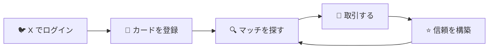
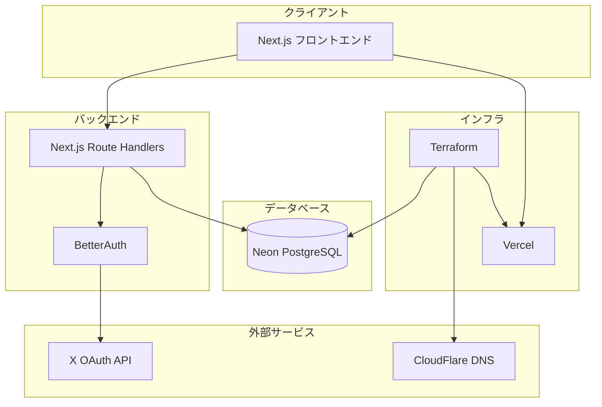

# xtrade

[](https://nextjs.org/)
[](https://codecov.io/gh/tqer39/xtrade)
[](https://github.com/tqer39/xtrade/actions/workflows/test.yml)
[](https://github.com/tqer39/xtrade/actions/workflows/terraform-dev.yml)
[](../LICENSE)

[🇺🇸 English](../README.md)

> **X (Twitter) を活用した信頼ベースのカードトレーディングプラットフォーム — 信頼できる人とだけ取引**

## 🎯 xtrade とは

xtrade は、X (Twitter) のソーシャルグラフを活用した**信頼ベースのカードトレーディングプラットフォーム**です。

従来のオンラインカード取引には、詐欺やドタキャン、見知らぬ人とのトラブルなどのリスクがつきものでした。xtrade は **X のソーシャルグラフを活用**することで、知り合いや信頼できる人とだけ取引できる環境を提供します。

- 🔐 **安心して取引** — X のフォロワーやつながりが信頼できる取引相手に
- 📊 **信頼スコア** — 匿名の評価ではなく、実際のソーシャル関係に基づく
- 🎴 **シームレスなマッチング** — 欲しいカードを持っている人、あなたのカードを欲しがっている人を発見

## ✨ 主な機能

| 機能 | 説明 |
| --- | --- |
| 🤝 **信頼ベースの取引** | X のソーシャルグラフと信頼スコアによる安全な取引 |
| 🐦 **X ログイン** | X OAuth によるワンクリック認証 |
| 🎴 **カード管理** | 所持カードと欲しいカードをコレクション管理 |
| 🔄 **スマートマッチング** | 取引条件に合うユーザーを自動発見 |
| 📝 **取引履歴** | すべての取引とステータスを記録 |
| 🏗️ **Infrastructure as Code** | Terraform による完全な IaC 管理 |

## 📊 使い方



### ユーザーフロー

1. **ログイン** — X アカウントで認証
2. **カード登録** — 所持カードと欲しいカードを追加
3. **マッチを探す** — 欲しいカードを持っているユーザーを発見
4. **取引** — 信頼できるユーザーとつながり、取引を完了
5. **信頼を構築** — 成功した取引が信頼スコアを向上

## 🏛️ アーキテクチャ



## 🛠 技術スタック

| カテゴリ | 技術 |
| --- | --- |
| **フロントエンド** | Next.js 15 (App Router), React, TypeScript |
| **バックエンド** | Next.js Route Handlers |
| **データベース** | Neon (Serverless PostgreSQL), Drizzle ORM |
| **認証** | BetterAuth + X OAuth |
| **インフラ** | Vercel, CloudFlare DNS, Terraform |
| **開発ツール** | mise, just, prek |

## 🚀 クイックスタート

```bash
# 1. リポジトリをクローン
git clone https://github.com/tqer39/xtrade.git
cd xtrade

# 2. 開発ツールをインストール（初回のみ）
make bootstrap

# 3. すべてをセットアップ
just setup

# 4. 開発サーバーを起動
npm run dev
```

ブラウザで [http://localhost:3000](http://localhost:3000) を開きます。

📖 **詳細なセットアップ手順**は [ローカル開発ガイド](./local-dev.ja.md) を参照してください。

## 📁 プロジェクト構成

```text
xtrade/
├── app/                    # Next.js App Router
│   ├── api/                # Route Handlers（API）
│   └── (pages)/            # ページコンポーネント
├── src/
│   ├── lib/                # ユーティリティ（auth, utils）
│   ├── db/                 # データベース接続とスキーマ
│   ├── modules/            # ドメインモジュール
│   │   ├── trades/         # トレードドメイン
│   │   ├── cards/          # カードドメイン
│   │   ├── matches/        # マッチングドメイン
│   │   └── trust/          # 信頼スコアドメイン
│   └── components/         # 共通 UI コンポーネント
├── infra/terraform/        # Infrastructure as Code
├── docs/                   # ドキュメント
└── e2e/                    # E2E テスト（Playwright）
```

📖 **詳細な構成**は [ディレクトリ構成](./directory-structure.ja.md) を参照してください。

## 📖 ドキュメント

| ドキュメント | 説明 |
| --- | --- |
| [ローカル開発](./local-dev.ja.md) | 完全なセットアップガイドとトラブルシューティング |
| [アーキテクチャ](./architecture.ja.md) | システム設計と技術的決定 |
| [ディレクトリ構成](./directory-structure.ja.md) | コードベースの構成 |
| [デプロイメント](./deployment.ja.md) | デプロイワークフローと環境 |
| [セキュリティ](./security.ja.md) | セキュリティ設計と認証 |
| [GitHub Secrets](./github-secrets.ja.md) | CI/CD シークレット設定 |
| [Terraform 環境変数](./terraform-environment-variables.ja.md) | インフラ環境セットアップ |

## 🤖 AI 駆動開発

xtrade は Claude Code の特化型サブエージェントを使用して開発を効率化しています：

| エージェント | 役割 |
| --- | --- |
| 🧠 **ArchAgent** | アーキテクチャ設計・規約 |
| 🗃 **DBAgent** | データベース・スキーマ管理（Drizzle） |
| 🔐 **AuthAgent** | 認証・セッション管理（BetterAuth） |
| 🛠 **APIAgent** | API・ビジネスロジック |
| 🎨 **UIAgent** | UI・UX |
| 🧪 **TestAgent** | テスト・品質保証 |
| 🔒 **SecurityAgent** | セキュリティチェック・脆弱性検出 |
| 📝 **DocAgent** | ドキュメント管理 |

📖 **エージェントの詳細**は [CLAUDE.md](../CLAUDE.md) を参照してください。

## 🌍 環境構成

| 環境 | URL | 説明 |
| --- | --- | --- |
| Local | `http://localhost:3000` | 開発用 |
| Dev | `https://xtrade-dev.tqer39.dev` | ステージング |
| Prod | `https://xtrade.tqer39.dev` | 本番 |

## 📄 ライセンス

このプロジェクトは [MIT ライセンス](../LICENSE) の下で公開されています。
