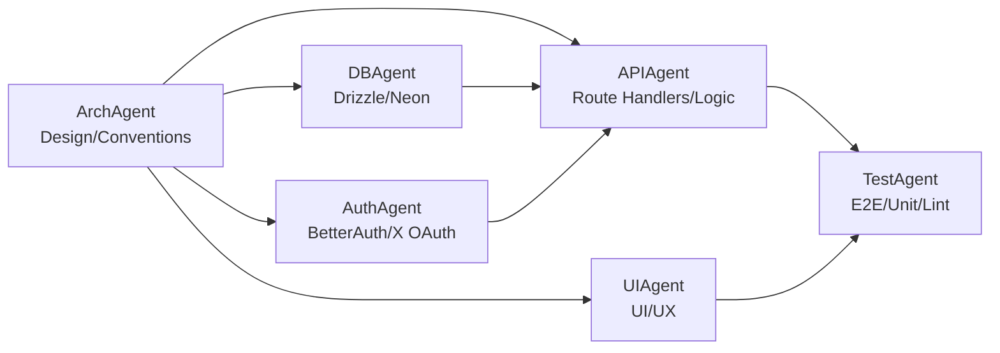
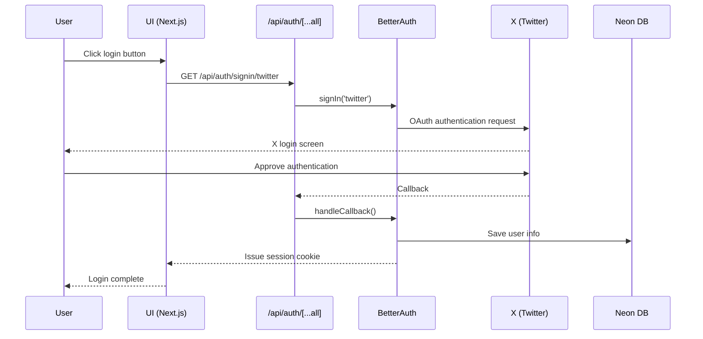
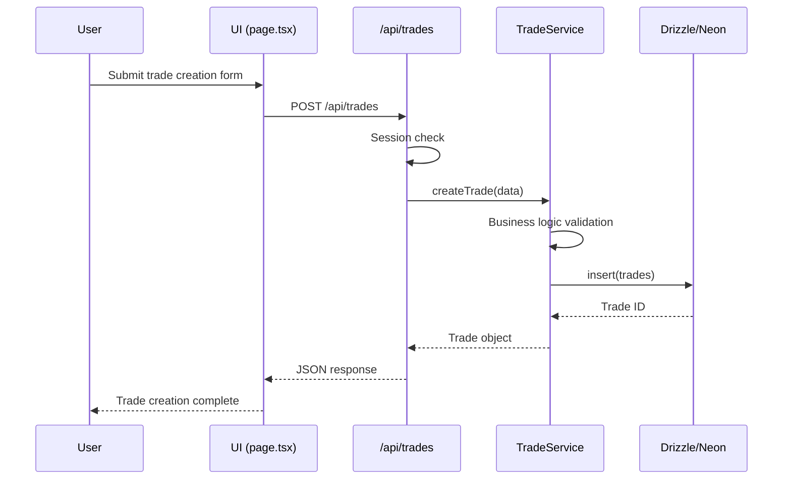
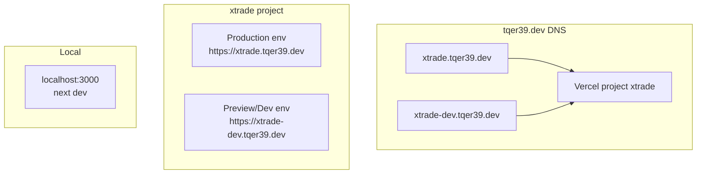

# xtrade Architecture Design Document

[🇯🇵 日本語版](./architecture.ja.md)

## Overview

xtrade is a real-time trading service that leverages X (formerly Twitter)'s social graph.
This document explains xtrade's technical architecture and design philosophy.

## System Architecture

### Overall Structure

```text
┌──────────────────────────────────────────────────────────┐
│                        Client                             │
│              (Next.js App Router / React)                │
└──────────────────┬───────────────────────────────────────┘
                   │
                   │ HTTPS
                   │
┌──────────────────▼───────────────────────────────────────┐
│                  Vercel (Hosting)                         │
│  ┌─────────────────────────────────────────────────────┐ │
│  │           Next.js App Router                        │ │
│  │  ┌──────────────────┐  ┌──────────────────────┐    │ │
│  │  │  Pages (SSR)     │  │  Route Handlers      │    │ │
│  │  │  - /            │  │  - /api/auth/**      │    │ │
│  │  │  - /rooms/*     │  │  - /api/trades/**    │    │ │
│  │  │  - /trades/*    │  │  - /api/rooms/**     │    │ │
│  │  └──────────────────┘  └──────────────────────┘    │ │
│  └─────────────────────────────────────────────────────┘ │
└──────────────────┬───────────────────────────────────────┘
                   │
    ┌──────────────┼──────────────┐
    │              │              │
┌───▼──────┐  ┌───▼──────┐  ┌───▼──────┐
│ BetterAuth│  │   Neon   │  │CloudFlare│
│  + X OAuth│  │   (DB)   │  │   DNS    │
└───────────┘  └──────────┘  └──────────┘
```

## Monorepo Structure

xtrade uses a monorepo structure, managing frontend, backend, and infrastructure in a single repository.

### Directory Structure

```text
xtrade/
├── app/                    # Next.js App Router
│   ├── (app)/             # Application routes
│   │   ├── layout.tsx     # Common layout
│   │   ├── page.tsx       # Top page
│   │   ├── rooms/         # Room list/details
│   │   └── trades/        # Trade list/details
│   ├── api/               # Route Handlers (API)
│   │   ├── auth/          # BetterAuth endpoints
│   │   │   └── [...all]/route.ts
│   │   ├── trades/        # Trade API
│   │   └── rooms/         # Room API
│   └── globals.css        # Global CSS
│
├── src/                   # Common library
│   ├── lib/               # Utilities
│   │   ├── auth.ts        # BetterAuth server config
│   │   └── auth-client.ts # BetterAuth client
│   ├── db/                # Database
│   │   ├── schema.ts      # Drizzle schema definition
│   │   └── drizzle.ts     # Drizzle client
│   ├── modules/           # Domain modules
│   │   ├── trades/        # Trade domain
│   │   │   └── service.ts # Trade service
│   │   └── rooms/         # Room domain
│   │       └── service.ts # Room service
│   └── components/        # Common UI components
│
├── terraform/             # Infrastructure config (IaC)
│   ├── modules/           # Reusable modules
│   │   ├── cloudflare/    # CloudFlare DNS module
│   │   ├── vercel/        # Vercel project module
│   │   └── neon/          # Neon DB module (future)
│   ├── environments/      # Environment-specific config
│   │   ├── dev/           # dev environment
│   │   │   ├── main.tf
│   │   │   ├── variables.tf
│   │   │   └── terraform.tfvars
│   │   └── prod/          # prod environment
│   │       ├── main.tf
│   │       ├── variables.tf
│   │       └── terraform.tfvars
│   └── global/            # Global resources
│       ├── dns.tf         # DNS zone
│       └── backend.tf     # Terraform state management
│
├── docs/                  # Documentation
│   ├── architecture.md    # This document
│   ├── api.md             # API specification
│   └── agents/            # Agent-specific docs
│
├── .github/               # GitHub related
│   ├── workflows/         # GitHub Actions
│   ├── CODEOWNERS         # Code owners
│   └── pull_request_template.md
│
├── .claude/               # Claude Code Agent config
│   └── agents/            # Agent definitions
│       ├── arch.md        # ArchAgent
│       ├── db.md          # DBAgent
│       ├── auth.md        # AuthAgent
│       ├── api.md         # APIAgent
│       ├── ui.md          # UIAgent
│       └── test.md        # TestAgent
│
└── scripts/               # Development scripts
```

## Layer Architecture

xtrade is composed of the following layers:

```text
┌─────────────────────────────────────────────────┐
│              Presentation Layer                 │
│         (app/**/*.tsx - Pages/UI)               │
└────────────────────┬────────────────────────────┘
                     │
┌────────────────────▼────────────────────────────┐
│              Application Layer                  │
│      (app/api/**/*.ts - Route Handlers)         │
└────────────────────┬────────────────────────────┘
                     │
┌────────────────────▼────────────────────────────┐
│               Domain Layer                      │
│     (src/modules/**/service.ts - Services)      │
└────────────────────┬────────────────────────────┘
                     │
┌────────────────────▼────────────────────────────┐
│            Infrastructure Layer                 │
│  (src/db/drizzle.ts, src/lib/auth.ts - DB/Auth)│
└─────────────────────────────────────────────────┘
```

### Layer Responsibilities

1. **Presentation Layer** (`app/**/*.tsx`)
   - UI components and pages
   - User interaction handling
   - Client-side state management

2. **Application Layer** (`app/api/**/*.ts`)
   - API endpoints via Route Handlers
   - Request/response transformation
   - Authentication and authorization checks
   - Calling Domain Layer

3. **Domain Layer** (`src/modules/**/service.ts`)
   - Business logic
   - Domain rule implementation
   - Transaction management

4. **Infrastructure Layer** (`src/db/`, `src/lib/`)
   - Database access
   - External service integration
   - Authentication infrastructure

## Agent Structure and Responsibilities

xtrade uses Claude Code's Sub Agent to develop with separated responsibilities.

### Agent List

#### 1. ArchAgent (Architecture Design & Conventions)

**Role**: Design and maintain xtrade's overall architecture and development conventions.

**Scope**:

- `README.md`, `docs/architecture.md`, `docs/api.md`
- Next.js structure (App Router, Route Handlers path design)
- Layer separation rules under `src/`
- Coding conventions
- Dependency library selection

**Prohibited**:

- Direct changes to concrete API or UI implementations
- Major refactoring of domain logic

#### 2. DBAgent (Database & Schema Management)

**Role**: Handle all database-related work with Neon + Drizzle.

**Scope**:

- `src/db/schema.ts`, `src/db/drizzle.ts`, `drizzle.config.ts`
- Migration generation and application
- Index and enum definitions

**Prohibited**:

- API business logic implementation
- UI implementation

#### 3. AuthAgent (Authentication & Session Management)

**Role**: Handle all BetterAuth configuration and X OAuth wiring.

**Scope**:

- `src/lib/auth.ts` (BetterAuth server config)
- `src/lib/auth-client.ts` (React client)
- `app/api/auth/[...all]/route.ts`
- Session retrieval helpers

**Prohibited**:

- Domain logic (trades/rooms, etc.)
- Direct DB schema changes

#### 4. APIAgent (API & Business Logic)

**Role**: Implement APIs with Route Handlers while maintaining trading state machine.

**Scope**:

- `app/api/trades/**/*.ts`
- `app/api/rooms/**/*.ts`
- `src/modules/**/service.ts` (domain service layer)

**Prohibited**:

- Drizzle schema definition changes
- UI implementation
- Major authentication config changes

#### 5. UIAgent (UI & UX)

**Role**: Build minimal UI quickly. Connect user flows seamlessly.

**Scope**:

- `app/**/page.tsx`
- Common layouts and navigation (`app/layout.tsx`)
- UI components (`src/components/**`)

**Prohibited**:

- Complex business logic
- Direct DB access

#### 6. TestAgent (Testing & Quality Assurance)

**Role**: Ensure nothing breaks at the use case level.

**Scope**:

- Unit tests: `src/modules/**/__tests__/*.test.ts`
- API tests: `app/api/**/__tests__/*.test.ts`
- E2E tests

**Prohibited**:

- Mass implementation of business logic itself

### Agent Dependencies



## Data Flow

### Authentication Flow



### Trade Creation Flow (Example)



## Environment Configuration

xtrade operates with 3 environments: local / dev / prod.

### URLs by Environment

| Environment | APP URL | DB | Notes |
| --- | --- | --- | --- |
| local | `http://localhost:3000` | Docker Postgres | Development |
| dev | `https://xtrade-dev.tqer39.dev` | Neon (xtrade-dev) | Staging/verification |
| prod | `https://xtrade.tqer39.dev` | Neon (xtrade-prod) | Production |

### Environment Variables Management

Environment-specific variables:

- `NEXT_PUBLIC_APP_URL` - Application URL
- `BETTER_AUTH_URL` - BetterAuth base URL
- `BETTER_AUTH_SECRET` - Session signing secret
- `DATABASE_URL` - Database connection string

All required environment variables are listed in `.env.example` and configured per environment in `.env.local`.

## Infrastructure Configuration (Terraform)

### DNS / Vercel Configuration



### Managed Resources

#### 1. CloudFlare DNS

- **Resource**: DNS zone for `tqer39.dev`
- **Records**:
  - `xtrade.tqer39.dev` → Vercel prod environment (CNAME)
  - `xtrade-dev.tqer39.dev` → Vercel dev environment (CNAME)

#### 2. Vercel

- **Project**: `xtrade`
- **Custom domains**:
  - Production: `xtrade.tqer39.dev`
  - Preview/Dev: `xtrade-dev.tqer39.dev`
- **Environment variables**: Managed by Terraform

#### 3. Terraform State Management

- **Backend**: S3 (AWS)
- **State file**: `s3://terraform-tfstate-tqer39-072693953877-ap-northeast-1/xtrade/`

### Terraform Directory Structure

```text
infra/terraform/
├── modules/           # Reusable modules
│   ├── cloudflare/   # CloudFlare DNS module
│   ├── vercel/       # Vercel project module
│   └── neon/         # Neon DB module
├── envs/              # Environment-specific config
│   ├── dev/          # dev environment
│   │   ├── database/ # Neon database
│   │   ├── frontend/ # Vercel project
│   │   └── dns/      # CloudFlare DNS records
│   └── prod/         # prod environment
└── config.yml        # Shared configuration
```

## Security Considerations

### Authentication & Authorization

- X OAuth authentication via BetterAuth
- Session management via cookies
- CSRF token protection (built into BetterAuth)
- Session expiration management

### Database

- Neon SSL connection required
- Connection strings managed via environment variables
- Migrations use unpooled connections

### Secrets Management

- `.env.local` excluded from Git
- Vercel environment variables configured via Web UI (encrypted storage)
- Terraform's `terraform.tfvars` added to `.gitignore`
- Sensitive values configured with `sensitive = true`

### CORS / CSP

- Next.js App Router uses same-origin policy by default
- API endpoints require authentication
- Consider adding CSP headers in the future

## Technology Selection Rationale

### Next.js App Router

- Hybrid of SSR and CSR
- API implementation via Route Handlers
- Performance improvement via React Server Components

### Drizzle ORM

- TypeScript native
- Type-safe SQL builder
- Good compatibility with Neon

### Neon

- Serverless PostgreSQL
- Environment isolation via branching feature
- Scalability

### BetterAuth

- Simple X OAuth implementation
- TypeScript support
- Easy integration with Next.js

### Terraform

- Infrastructure as code
- Version control
- Environment reproducibility

## Future Expansion Plans

### Phase 1: MVP (Current)

- X login
- Trading room creation/joining
- Basic trading features

### Phase 2: Feature Expansion

- Real-time notifications
- Trade history visualization
- User rankings

### Phase 3: Scaling

- Leverage Neon Read Replica
- Add cache layer (Redis)
- CDN optimization

## Change History

- 2025-11-23: Initial version created (ArchAgent)
