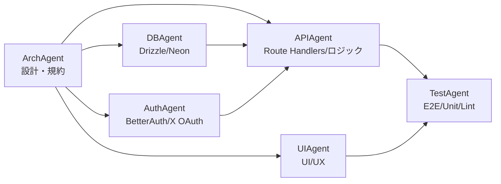
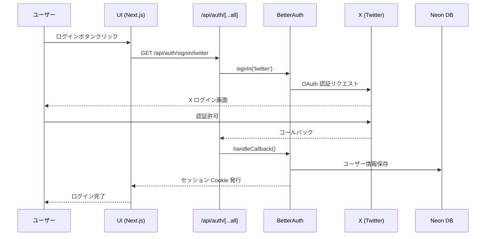
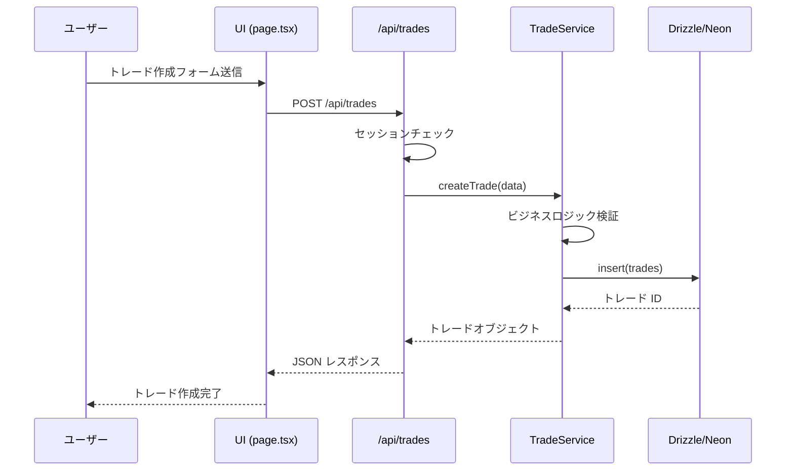
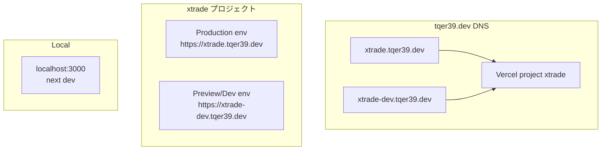

# xtrade アーキテクチャ設計書

## 概要

xtrade は、X (旧 Twitter) のソーシャルグラフを活用したリアルタイムトレーディングサービスです。
本ドキュメントでは、xtrade の技術的なアーキテクチャと設計思想を説明します。

## システムアーキテクチャ

### 全体構成

```text
┌──────────────────────────────────────────────────────────┐
│                      クライアント                         │
│              (Next.js App Router / React)                │
└──────────────────┬───────────────────────────────────────┘
                   │
                   │ HTTPS
                   │
┌──────────────────▼───────────────────────────────────────┐
│                  Vercel (ホスティング)                    │
│  ┌─────────────────────────────────────────────────────┐ │
│  │           Next.js App Router                        │ │
│  │  ┌──────────────────┐  ┌──────────────────────┐    │ │
│  │  │  Pages (SSR)     │  │  Route Handlers      │    │ │
│  │  │  - /            │  │  - /api/auth/**      │    │ │
│  │  │  - /rooms/*     │  │  - /api/trades/**    │    │ │
│  │  │  - /trades/*    │  │  - /api/rooms/**     │    │ │
│  │  └──────────────────┘  └──────────────────────┘    │ │
│  └─────────────────────────────────────────────────────┘ │
└──────────────────┬───────────────────────────────────────┘
                   │
    ┌──────────────┼──────────────┐
    │              │              │
┌───▼──────┐  ┌───▼──────┐  ┌───▼──────┐
│ BetterAuth│  │   Neon   │  │   GCP    │
│  + X OAuth│  │   (DB)   │  │Cloud DNS │
└───────────┘  └──────────┘  └──────────┘
```

## モノレポ構成

xtrade はモノレポ構成で、フロントエンド・バックエンド・インフラをすべて 1 つのリポジトリで管理します。

### ディレクトリ構造

```text
xtrade/
├── app/                    # Next.js App Router
│   ├── (app)/             # アプリケーションルート
│   │   ├── layout.tsx     # 共通レイアウト
│   │   ├── page.tsx       # トップページ
│   │   ├── rooms/         # ルーム一覧・詳細
│   │   └── trades/        # トレード一覧・詳細
│   ├── api/               # Route Handlers（API）
│   │   ├── auth/          # BetterAuth エンドポイント
│   │   │   └── [...all]/route.ts
│   │   ├── trades/        # トレード API
│   │   └── rooms/         # ルーム API
│   └── globals.css        # グローバル CSS
│
├── src/                   # 共通ライブラリ
│   ├── lib/               # ユーティリティ
│   │   ├── auth.ts        # BetterAuth サーバー設定
│   │   └── auth-client.ts # BetterAuth クライアント
│   ├── db/                # データベース
│   │   ├── schema.ts      # Drizzle スキーマ定義
│   │   └── drizzle.ts     # Drizzle クライアント
│   ├── modules/           # ドメインモジュール
│   │   ├── trades/        # トレードドメイン
│   │   │   └── service.ts # トレードサービス
│   │   └── rooms/         # ルームドメイン
│   │       └── service.ts # ルームサービス
│   └── components/        # 共通 UI コンポーネント
│
├── terraform/             # インフラ構成（IaC）
│   ├── modules/           # 再利用可能なモジュール
│   │   ├── dns/           # GCP Cloud DNS モジュール
│   │   ├── vercel/        # Vercel プロジェクトモジュール
│   │   └── neon/          # Neon DB モジュール（将来対応）
│   ├── environments/      # 環境ごとの設定
│   │   ├── dev/           # dev 環境
│   │   │   ├── main.tf
│   │   │   ├── variables.tf
│   │   │   └── terraform.tfvars
│   │   └── prod/          # prod 環境
│   │       ├── main.tf
│   │       ├── variables.tf
│   │       └── terraform.tfvars
│   └── global/            # グローバルリソース
│       ├── dns.tf         # DNS ゾーン
│       └── backend.tf     # Terraform state 管理
│
├── docs/                  # ドキュメント
│   ├── architecture.md    # 本ドキュメント
│   ├── api.md             # API 仕様書
│   └── agents/            # Agent 別ドキュメント
│
├── .github/               # GitHub 関連
│   ├── workflows/         # GitHub Actions
│   ├── CODEOWNERS         # コードオーナー
│   └── pull_request_template.md
│
├── .claude/               # Claude Code Agent 設定
│   └── agents/            # Agent 定義
│       ├── arch.md        # ArchAgent
│       ├── db.md          # DBAgent
│       ├── auth.md        # AuthAgent
│       ├── api.md         # APIAgent
│       ├── ui.md          # UIAgent
│       └── test.md        # TestAgent
│
└── scripts/               # 開発用スクリプト
```

## レイヤアーキテクチャ

xtrade は以下のレイヤで構成されます：

```text
┌─────────────────────────────────────────────────┐
│              Presentation Layer                 │
│         (app/**/*.tsx - Pages/UI)               │
└────────────────────┬────────────────────────────┘
                     │
┌────────────────────▼────────────────────────────┐
│              Application Layer                  │
│      (app/api/**/*.ts - Route Handlers)         │
└────────────────────┬────────────────────────────┘
                     │
┌────────────────────▼────────────────────────────┐
│               Domain Layer                      │
│     (src/modules/**/service.ts - Services)      │
└────────────────────┬────────────────────────────┘
                     │
┌────────────────────▼────────────────────────────┐
│            Infrastructure Layer                 │
│  (src/db/drizzle.ts, src/lib/auth.ts - DB/Auth)│
└─────────────────────────────────────────────────┘
```

### レイヤの責務

1. **Presentation Layer** (`app/**/*.tsx`)
   - UI コンポーネントとページ
   - ユーザーインタラクション処理
   - クライアントサイドの状態管理

2. **Application Layer** (`app/api/**/*.ts`)
   - Route Handlers による API エンドポイント
   - リクエスト/レスポンスの変換
   - 認証・認可チェック
   - Domain Layer の呼び出し

3. **Domain Layer** (`src/modules/**/service.ts`)
   - ビジネスロジック
   - ドメインルールの実装
   - トランザクション管理

4. **Infrastructure Layer** (`src/db/`, `src/lib/`)
   - データベースアクセス
   - 外部サービス連携
   - 認証基盤

## Agent 構成と責務

xtrade では、Claude Code の Sub Agent を活用して責務を分離した開発を行います。

### Agent 一覧

#### 1. ArchAgent（アーキテクチャ設計・規約）

**役割**: xtrade 全体のアーキテクチャと開発規約を設計・維持する。

**担当範囲**:
- `README.md`, `docs/architecture.md`, `docs/api.md`
- Next.js 構成（App Router、Route Handlers のパス設計）
- `src/` 以下のレイヤ分けルール
- コーディング規約
- 依存ライブラリの選定

**禁止事項**:
- 具体的な API 実装や UI 実装への直接的な変更
- ドメインロジックの大幅な改修

#### 2. DBAgent（データベース・スキーマ管理）

**役割**: Neon + Drizzle の DB 周りを一手に引き受ける。

**担当範囲**:
- `src/db/schema.ts`, `src/db/drizzle.ts`, `drizzle.config.ts`
- マイグレーション生成・適用
- インデックス・enum 定義

**禁止事項**:
- API のビジネスロジック実装
- UI 実装

#### 3. AuthAgent（認証・セッション管理）

**役割**: BetterAuth の設定と X OAuth の配線を全て担当する。

**担当範囲**:
- `src/lib/auth.ts`（BetterAuth サーバ設定）
- `src/lib/auth-client.ts`（React クライアント）
- `app/api/auth/[...all]/route.ts`
- セッション取得ヘルパー

**禁止事項**:
- ドメインロジック（トレード / ルームなど）
- DB スキーマ本体の変更

#### 4. APIAgent（API・ビジネスロジック）

**役割**: 取引ステートマシンを守りつつ、Route Handlers で API を実装する。

**担当範囲**:
- `app/api/trades/**/*.ts`
- `app/api/rooms/**/*.ts`
- `src/modules/**/service.ts`（ドメインサービス層）

**禁止事項**:
- Drizzle のスキーマ定義変更
- UI 実装
- Auth 設定の大幅変更

#### 5. UIAgent（UI・UX）

**役割**: 最低限の UI をサクサク組む。ユーザーフローを途切れなく繋ぐ。

**担当範囲**:
- `app/**/page.tsx`
- 共通レイアウト・ナビ（`app/layout.tsx`）
- UI コンポーネント（`src/components/**`）

**禁止事項**:
- 複雑なビジネスロジック
- DB 直接アクセス

#### 6. TestAgent（テスト・品質保証）

**役割**: ユースケース単位で壊れてないかを担保する。

**担当範囲**:
- Unit テスト：`src/modules/**/__tests__/*.test.ts`
- API テスト：`app/api/**/__tests__/*.test.ts`
- E2E テスト

**禁止事項**:
- ビジネスロジックそのものの大量実装

### Agent 間の依存関係



## データフロー

### 認証フロー



### トレード作成フロー（例）



## 環境構成

xtrade は local / dev / prod の 3 環境で運用します。

### 環境ごとの URL

| 環境  | APP URL                          | DB                       | 備考                  |
| ----- | -------------------------------- | ------------------------ | --------------------- |
| local | `http://localhost:3000`          | Docker Postgres          | 開発用                |
| dev   | `https://xtrade-dev.tqer39.dev`  | Neon (xtrade-dev)        | ステージング・動作確認 |
| prod  | `https://xtrade.tqer39.dev`      | Neon (xtrade-prod)       | 本番                  |

### 環境変数管理

環境ごとに異なる環境変数：

- `NEXT_PUBLIC_APP_URL` - アプリケーション URL
- `BETTER_AUTH_URL` - BetterAuth のベース URL
- `BETTER_AUTH_SECRET` - セッション署名用シークレット
- `DATABASE_URL` - データベース接続文字列

`.env.example` にすべての必要な環境変数を記載し、`.env.local` で環境ごとに設定します。

## インフラ構成（Terraform）

### DNS / Vercel 構成



### 管理対象リソース

#### 1. GCP Cloud DNS

- **リソース**: `tqer39.dev` の DNS ゾーン
- **レコード**:
  - `xtrade.tqer39.dev` → Vercel の prod 環境
  - `xtrade-dev.tqer39.dev` → Vercel の dev 環境

#### 2. Vercel

- **プロジェクト**: `xtrade`
- **カスタムドメイン**:
  - Production: `xtrade.tqer39.dev`
  - Preview/Dev: `xtrade-dev.tqer39.dev`
- **環境変数**: Terraform で管理

#### 3. Terraform State 管理

- **バックエンド**: GCS（Google Cloud Storage）
- **State ファイル**: `gs://xtrade-terraform-state/`

### Terraform ディレクトリ構成

```text
terraform/
├── modules/           # 再利用可能なモジュール
│   ├── dns/          # GCP Cloud DNS モジュール
│   ├── vercel/       # Vercel プロジェクト・ドメインモジュール
│   └── neon/         # Neon DB（将来対応）
├── environments/      # 環境ごとの設定
│   ├── dev/          # dev 環境
│   └── prod/         # prod 環境
└── global/           # グローバルリソース
    ├── dns.tf        # DNS ゾーン
    └── backend.tf    # Terraform state 管理
```

## セキュリティ考慮事項

### 認証・認可

- BetterAuth による X OAuth 認証
- セッション Cookie による状態管理
- CSRF トークン保護（BetterAuth 内蔵）
- セッション有効期限管理

### データベース

- Neon の SSL 接続必須
- 接続文字列は環境変数で管理
- マイグレーションは unpooled 接続を使用

### Secrets 管理

- `.env.local` は Git 管理外
- Vercel 環境変数は Web UI で設定（暗号化保存）
- Terraform の `terraform.tfvars` は `.gitignore` に追加
- センシティブな値は `sensitive = true` を設定

### CORS / CSP

- Next.js の App Router はデフォルトで同一オリジンポリシー
- API エンドポイントは認証必須
- 将来的に CSP ヘッダーの追加を検討

## 技術選定の理由

### Next.js App Router

- SSR と CSR のハイブリッド
- Route Handlers による API 実装
- React Server Components によるパフォーマンス向上

### Drizzle ORM

- TypeScript ネイティブ
- 型安全な SQL ビルダー
- Neon との相性が良い

### Neon

- Serverless PostgreSQL
- ブランチ機能による環境分離
- スケーラビリティ

### BetterAuth

- X OAuth のシンプルな実装
- TypeScript サポート
- Next.js との統合が容易

### Terraform

- インフラのコード化
- バージョン管理
- 環境の再現性

## 今後の拡張計画

### Phase 1: MVP（現在）

- X ログイン
- トレーディングルームの作成・参加
- 基本的な取引機能

### Phase 2: 機能拡張

- リアルタイム通知
- トレード履歴の可視化
- ユーザーランキング

### Phase 3: スケーリング

- Neon Read Replica の活用
- キャッシュ層の追加（Redis）
- CDN の最適化

## 変更履歴

- 2025-11-23: 初版作成（ArchAgent）
