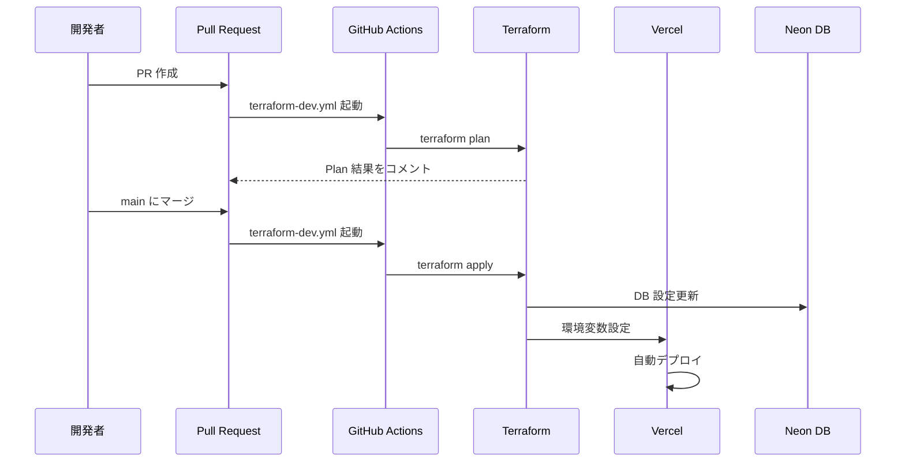
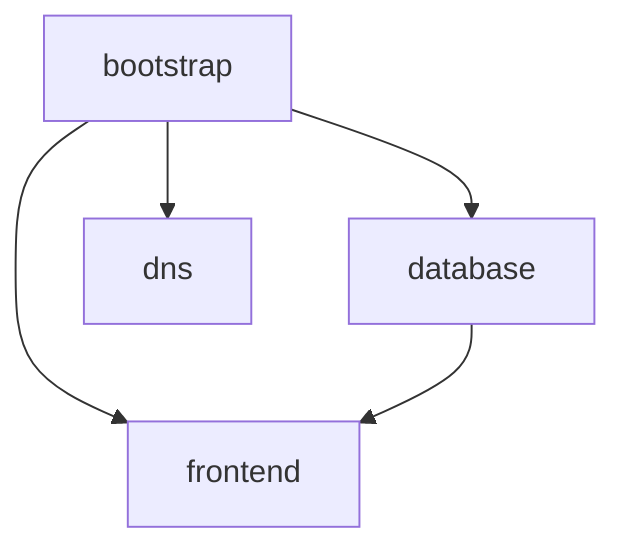

# デプロイメントガイド

[🇺🇸 English](./deployment.md)

このドキュメントでは、xtrade の各環境（local / dev / prod）へのデプロイフローを説明します。

## 環境一覧

| 環境 | URL | データベース | デプロイトリガー |
| ---- | --- | ------------ | ---------------- |
| local | `http://localhost:3000` | Docker Postgres | 手動（`npm run dev`） |
| dev | `https://xtrade-dev.tqer39.dev` | Neon xtrade-dev | main マージ時に自動 |
| prod | `https://xtrade.tqer39.dev` | Neon xtrade-prod | 未構築（将来実装） |

## 環境変数の管理

### 環境変数の設定場所

| 環境 | 設定場所 | 管理方法 |
| ---- | -------- | -------- |
| local | `.env.local` | 手動（Git 管理外） |
| dev | Vercel 環境変数 | Terraform + GitHub Secrets |
| prod | Vercel 環境変数 | Terraform + GitHub Secrets |

### 必要な環境変数

| 変数名 | 説明 | local | dev | prod |
| ------ | ---- | ----- | --- | ---- |
| `DATABASE_URL` | DB 接続文字列 | `.env.local` | Terraform 自動設定 | Terraform 自動設定 |
| `BETTER_AUTH_URL` | 認証 URL | `.env.local` | Terraform 自動設定 | Terraform 自動設定 |
| `BETTER_AUTH_SECRET` | 認証シークレット | `.env.local` | GitHub Secrets 経由 | GitHub Secrets 経由 |
| `NEXT_PUBLIC_APP_URL` | アプリ URL | `.env.local` | Terraform 自動設定 | Terraform 自動設定 |
| `TWITTER_CLIENT_ID` | X OAuth ID | `.env.local` | GitHub Secrets 経由 | GitHub Secrets 経由 |
| `TWITTER_CLIENT_SECRET` | X OAuth Secret | `.env.local` | GitHub Secrets 経由 | GitHub Secrets 経由 |

## デプロイフロー詳細

### Local 環境

```bash
# 1. 環境変数の設定
cp .env.example .env.local
# .env.local を編集して実際の値を設定

# 2. データベース起動
just db-start

# 3. マイグレーション実行
just db-migrate

# 4. 開発サーバー起動
npm run dev
```

### Dev 環境

#### デプロイの流れ



#### トリガー条件

| イベント | アクション | 対象ディレクトリ |
| -------- | ---------- | ---------------- |
| PR 作成/更新 | `terraform plan` | bootstrap, database, dns, frontend |
| main マージ | `terraform apply` | 差分があるディレクトリのみ |
| 手動実行 | `terraform plan` or `apply` | 選択可能 |

#### GitHub Secrets（dev 用）

以下の Secrets を GitHub リポジトリに設定する必要があります：

| Secret 名 | 説明 | 設定場所 |
| --------- | ---- | -------- |
| `NEON_API_KEY` | Neon API キー | GitHub Secrets |
| `VERCEL_API_TOKEN` | Vercel API トークン | GitHub Secrets |
| `CLOUDFLARE_API_TOKEN` | CloudFlare API トークン | GitHub Secrets |
| `CLOUDFLARE_ACCOUNT_ID` | CloudFlare アカウント ID | GitHub Secrets |
| `CLOUDFLARE_ZONE_ID` | CloudFlare Zone ID | GitHub Secrets |
| `BETTER_AUTH_SECRET_DEV` | 認証シークレット（dev） | GitHub Secrets |
| `TWITTER_CLIENT_ID_DEV` | X OAuth ID（dev） | GitHub Secrets |
| `TWITTER_CLIENT_SECRET_DEV` | X OAuth Secret（dev） | GitHub Secrets |

#### GitHub Secrets（prod 用）

prod 環境では以下の Secrets を**別途**設定する必要があります（dev とは異なる値）：

| Secret 名 | 説明 | 設定場所 |
| --------- | ---- | -------- |
| `NEON_API_KEY` | Neon API キー（共通） | GitHub Secrets |
| `VERCEL_API_TOKEN` | Vercel API トークン（共通） | GitHub Secrets |
| `CLOUDFLARE_API_TOKEN` | CloudFlare API トークン（共通） | GitHub Secrets |
| `CLOUDFLARE_ACCOUNT_ID` | CloudFlare アカウント ID（共通） | GitHub Secrets |
| `CLOUDFLARE_ZONE_ID` | CloudFlare Zone ID（共通） | GitHub Secrets |
| `BETTER_AUTH_SECRET_PROD` | 認証シークレット（prod）**※dev とは別の値** | GitHub Secrets |
| `TWITTER_CLIENT_ID_PROD` | X OAuth ID（prod）**※prod 用 X アプリ** | GitHub Secrets |
| `TWITTER_CLIENT_SECRET_PROD` | X OAuth Secret（prod）**※prod 用 X アプリ** | GitHub Secrets |

> **重要**: `BETTER_AUTH_SECRET`、`TWITTER_CLIENT_ID`、`TWITTER_CLIENT_SECRET` は dev と prod で**必ず異なる値**を使用してください。セキュリティ分離と環境の独立性を確保するためです。

#### Terraform ディレクトリ構成

```text
infra/terraform/envs/dev/
├── bootstrap/    # AWS S3 バックエンド設定
├── database/     # Neon データベース
├── dns/          # CloudFlare DNS レコード
└── frontend/     # Vercel プロジェクト + 環境変数
```

各ディレクトリの依存関係：



### Prod 環境

**注意**: prod 環境は現在未構築です。将来的に以下の構成で実装予定：

- `infra/terraform/envs/prod/` ディレクトリを作成
- `terraform-prod.yml` ワークフローを作成
- 本番用 GitHub Secrets を設定

## Vercel の環境変数設定

### Terraform による自動設定

`infra/terraform/envs/dev/frontend/main.tf` で以下の環境変数が自動設定されます：

```hcl
environment_variables = {
  DATABASE_URL          = data.terraform_remote_state.database.outputs.database_connection_uri_pooled
  DATABASE_URL_UNPOOLED = data.terraform_remote_state.database.outputs.database_connection_uri
  NODE_ENV              = "production"
  BETTER_AUTH_URL       = "https://xtrade-dev.tqer39.dev"
  NEXT_PUBLIC_APP_URL   = "https://xtrade-dev.tqer39.dev"
  BETTER_AUTH_SECRET    = var.better_auth_secret    # GitHub Secrets から
  TWITTER_CLIENT_ID     = var.twitter_client_id     # GitHub Secrets から
  TWITTER_CLIENT_SECRET = var.twitter_client_secret # GitHub Secrets から
}
```

### 手動で Vercel に環境変数を設定する場合

1. [Vercel Dashboard](https://vercel.com/) にログイン
2. プロジェクト → **Settings** → **Environment Variables**
3. 各変数を設定（Environment: Production / Preview / Development を選択）

## X Developer Portal の設定

### コールバック URL

X Developer Portal で以下のコールバック URL を登録する必要があります：

| 環境 | コールバック URL |
| ---- | ---------------- |
| local | `http://localhost:3000/api/auth/callback/twitter` |
| dev | `https://xtrade-dev.tqer39.dev/api/auth/callback/twitter` |
| prod | `https://xtrade.tqer39.dev/api/auth/callback/twitter` |

### アプリ構成の選択肢

| 構成 | メリット | デメリット |
| ---- | -------- | ---------- |
| **1つのアプリで全環境** | 管理が簡単 | コールバック URL が増える |
| **環境ごとに別アプリ** | 環境分離、レート制限分離 | 管理が複雑 |

現在は **1つのアプリで全環境** を使用しています。

## トラブルシューティング

### 500 Internal Server Error

原因の確認順序：

1. **環境変数の確認**: Vercel Dashboard で環境変数が正しく設定されているか
2. **Terraform apply の確認**: `frontend` ディレクトリが apply されているか
3. **Vercel ログの確認**: Deployments → Functions でエラーログを確認

### 403 Forbidden

原因：`trustedOrigins` の設定に問題があります。

- `src/lib/auth.ts` の `trustedOrigins` にアクセス元の URL が含まれているか確認
- Vercel プレビュー URL（`*.vercel.app`）は自動で許可されています

### Terraform apply が実行されない

確認事項：

1. GitHub Secrets が正しく設定されているか
2. 該当ディレクトリに差分があるか
3. ワークフローの `paths-ignore` に該当していないか

### 手動で Terraform を実行する

```bash
# GitHub Actions から手動実行
# Actions → Terraform - dev → Run workflow
# RUN_APPLY: true を選択
```

## 参考ドキュメント

- [GitHub Secrets 設定](./github-secrets.ja.md)
- [Terraform 環境変数](./terraform-environment-variables.ja.md)
- [アーキテクチャ](./architecture.ja.md)
- [ローカル開発ガイド](./local-dev.ja.md)
