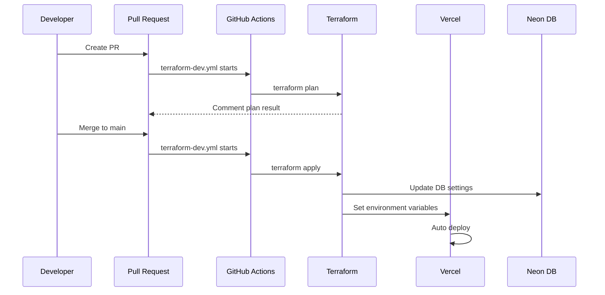
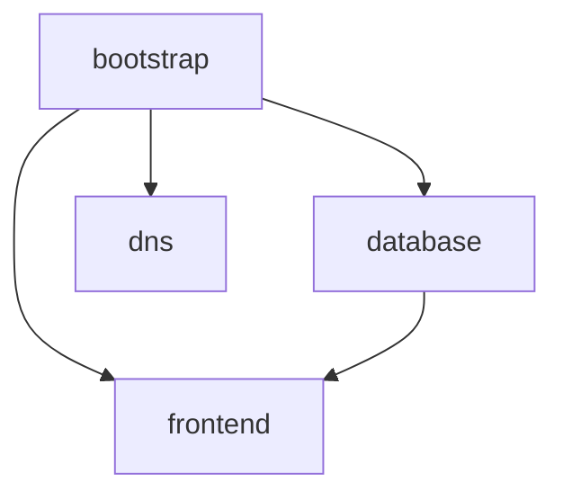

# Deployment Guide

[🇯🇵 日本語](./deployment.ja.md)

This document explains the deployment flow for each xtrade environment (local / dev / prod).

## Environments

| Environment | URL | Database | Deploy Trigger |
| ----------- | --- | -------- | -------------- |
| local | `http://localhost:3000` | Docker Postgres | Manual (`npm run dev`) |
| dev | `https://xtrade-dev.tqer39.dev` | Neon xtrade-dev | Auto on main merge |
| prod | `https://xtrade.tqer39.dev` | Neon xtrade-prod | Not built yet (future) |

## Environment Variable Management

### Where Variables Are Set

| Environment | Location | Management |
| ----------- | -------- | ---------- |
| local | `.env.local` | Manual (not in Git) |
| dev | Vercel Environment Variables | Terraform + GitHub Secrets |
| prod | Vercel Environment Variables | Terraform + GitHub Secrets |

### Required Environment Variables

| Variable | Description | local | dev | prod |
| -------- | ----------- | ----- | --- | ---- |
| `DATABASE_URL` | DB connection string | `.env.local` | Terraform auto-set | Terraform auto-set |
| `BETTER_AUTH_URL` | Auth URL | `.env.local` | Terraform auto-set | Terraform auto-set |
| `BETTER_AUTH_SECRET` | Auth secret | `.env.local` | Via GitHub Secrets | Via GitHub Secrets |
| `NEXT_PUBLIC_APP_URL` | App URL | `.env.local` | Terraform auto-set | Terraform auto-set |
| `TWITTER_CLIENT_ID` | X OAuth ID | `.env.local` | Via GitHub Secrets | Via GitHub Secrets |
| `TWITTER_CLIENT_SECRET` | X OAuth Secret | `.env.local` | Via GitHub Secrets | Via GitHub Secrets |

## Detailed Deployment Flow

### Local Environment

```bash
# 1. Set environment variables
cp .env.example .env.local
# Edit .env.local with actual values

# 2. Start database
just db-start

# 3. Run migrations
just db-migrate

# 4. Start development server
npm run dev
```

### Dev Environment

#### Deployment Flow



#### Trigger Conditions

| Event | Action | Target Directories |
| ----- | ------ | ------------------ |
| PR create/update | `terraform plan` | bootstrap, database, dns, frontend |
| Merge to main | `terraform apply` | Only directories with changes |
| Manual run | `terraform plan` or `apply` | Selectable |

#### GitHub Secrets (for dev)

The following Secrets must be set in the GitHub repository:

| Secret Name | Description | Location |
| ----------- | ----------- | -------- |
| `NEON_API_KEY` | Neon API key | GitHub Secrets |
| `VERCEL_API_TOKEN` | Vercel API token | GitHub Secrets |
| `CLOUDFLARE_API_TOKEN` | CloudFlare API token | GitHub Secrets |
| `CLOUDFLARE_ACCOUNT_ID` | CloudFlare account ID | GitHub Secrets |
| `CLOUDFLARE_ZONE_ID` | CloudFlare Zone ID | GitHub Secrets |
| `BETTER_AUTH_SECRET_DEV` | Auth secret (dev) | GitHub Secrets |
| `TWITTER_CLIENT_ID_DEV` | X OAuth ID (dev) | GitHub Secrets |
| `TWITTER_CLIENT_SECRET_DEV` | X OAuth Secret (dev) | GitHub Secrets |

#### GitHub Secrets (for prod)

The following Secrets must be set **separately** for prod environment (different values from dev):

| Secret Name | Description | Location |
| ----------- | ----------- | -------- |
| `NEON_API_KEY` | Neon API key (shared) | GitHub Secrets |
| `VERCEL_API_TOKEN` | Vercel API token (shared) | GitHub Secrets |
| `CLOUDFLARE_API_TOKEN` | CloudFlare API token (shared) | GitHub Secrets |
| `CLOUDFLARE_ACCOUNT_ID` | CloudFlare account ID (shared) | GitHub Secrets |
| `CLOUDFLARE_ZONE_ID` | CloudFlare Zone ID (shared) | GitHub Secrets |
| `BETTER_AUTH_SECRET_PROD` | Auth secret (prod) **※Different from dev** | GitHub Secrets |
| `TWITTER_CLIENT_ID_PROD` | X OAuth ID (prod) **※prod X app** | GitHub Secrets |
| `TWITTER_CLIENT_SECRET_PROD` | X OAuth Secret (prod) **※prod X app** | GitHub Secrets |

> **Important**: `BETTER_AUTH_SECRET`, `TWITTER_CLIENT_ID`, and `TWITTER_CLIENT_SECRET` must use **different values** for dev and prod. This ensures security isolation and environment independence.

#### Terraform Directory Structure

```text
infra/terraform/envs/dev/
├── bootstrap/    # AWS S3 backend configuration
├── database/     # Neon database
├── dns/          # CloudFlare DNS records
└── frontend/     # Vercel project + environment variables
```

Directory dependencies:



### Prod Environment

**Note**: prod environment is not yet built. Future implementation will include:

- Create `infra/terraform/envs/prod/` directory
- Create `terraform-prod.yml` workflow
- Set up production GitHub Secrets

## Vercel Environment Variable Configuration

### Automatic Configuration via Terraform

The following environment variables are automatically set in `infra/terraform/envs/dev/frontend/main.tf`:

```hcl
environment_variables = {
  DATABASE_URL          = data.terraform_remote_state.database.outputs.database_connection_uri_pooled
  DATABASE_URL_UNPOOLED = data.terraform_remote_state.database.outputs.database_connection_uri
  NODE_ENV              = "production"
  BETTER_AUTH_URL       = "https://xtrade-dev.tqer39.dev"
  NEXT_PUBLIC_APP_URL   = "https://xtrade-dev.tqer39.dev"
  BETTER_AUTH_SECRET    = var.better_auth_secret    # From GitHub Secrets
  TWITTER_CLIENT_ID     = var.twitter_client_id     # From GitHub Secrets
  TWITTER_CLIENT_SECRET = var.twitter_client_secret # From GitHub Secrets
}
```

### Manual Vercel Environment Variable Configuration

1. Log in to [Vercel Dashboard](https://vercel.com/)
2. Project → **Settings** → **Environment Variables**
3. Set each variable (select Environment: Production / Preview / Development)

## X Developer Portal Configuration

### Callback URLs

The following callback URLs must be registered in X Developer Portal:

| Environment | Callback URL |
| ----------- | ------------ |
| local | `http://localhost:3000/api/auth/callback/twitter` |
| dev | `https://xtrade-dev.tqer39.dev/api/auth/callback/twitter` |
| prod | `https://xtrade.tqer39.dev/api/auth/callback/twitter` |

### App Configuration Options

| Configuration | Pros | Cons |
| ------------- | ---- | ---- |
| **One app for all environments** | Simple management | More callback URLs |
| **Separate app per environment** | Environment isolation, rate limit separation | Complex management |

Currently using **one app for all environments**.

## Troubleshooting

### 500 Internal Server Error

Check in this order:

1. **Verify environment variables**: Check if variables are correctly set in Vercel Dashboard
2. **Verify Terraform apply**: Check if `frontend` directory has been applied
3. **Check Vercel logs**: Deployments → Functions for error logs

### 403 Forbidden

Cause: `trustedOrigins` configuration issue

- Check if the access origin URL is included in `trustedOrigins` in `src/lib/auth.ts`
- Vercel preview URLs (`*.vercel.app`) are automatically allowed

### Terraform apply Not Running

Check:

1. GitHub Secrets are correctly configured
2. There are changes in the target directory
3. Not excluded by workflow `paths-ignore`

### Run Terraform Manually

```bash
# Manual run from GitHub Actions
# Actions → Terraform - dev → Run workflow
# Select RUN_APPLY: true
```

## Reference Documentation

- [GitHub Secrets Configuration](./github-secrets.ja.md)
- [Terraform Environment Variables](./terraform-environment-variables.ja.md)
- [Architecture](./architecture.md)
- [Local Development Guide](./local-dev.ja.md)
